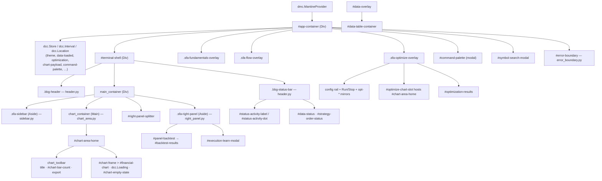

# Dashboard UI Architecture

How the Dash dashboard is assembled: the component tree, which file owns which
region, and the recipes for extending it (indicators, themes, shortcuts).

Entry point: `python main.py` → `run_dashboard()` builds the Dash app, sets
`app.layout = create_dashboard_layout(theme, bootstrap)`, then
`register_callbacks(app)`.

---

## Component tree

The whole tree is wrapped in a single `dmc.MantineProvider` so `dmc.Select`
(the searchable ticker box) has Mantine context. Everything is composed **once**
by `create_dashboard_layout` — see the note in `shell.py` about why the stores
live in one builder (avoids the dual-walk bug where two callbacks could see
different `dcc.Store` id sets).

---

## Layout file map

All under [`lib/dash/layout/`](../lib/dash/layout/):

| File | Owns |
| --- | --- |
| `shell.py` | Top-level composer. Emits every `dcc.Store` / `dcc.Interval` / hidden preload div, the four visible regions, the overlays, and the command palette. Also `wire_command_palette_is_open()`. |
| `header.py` | The Bloomberg-style header tape **and** the dense bottom status bar (`_create_header`, `_create_status_bar`). |
| `sidebar.py` | Left sidebar: Market Data, Saved Configurations, Chart Settings. |
| `chart_area.py` | Center chart region: `#chart-area-home` wraps toolbar + `#financial-chart` (reparented into `#optimize-chart-slot` on `/optimize`). |
| `right_panel.py` | Right panel shell: Backtest-only rail. |
| `backtest_panel.py` | Backtest tab accordion + execution-mode cards; emits `execution-learn-modal`; **OPEN OPTIMIZER** and **OPEN DATA** CTAs. SoT for capital/window/costs. |
| `data_overlay.py` | Shared Data overlay: singleton filters, CSV export, summary strip, and table host. |
| `optimizer_workspace.py` | Full-screen `/optimize/<ticker>` overlay: `opt-*` mirrors, universe, chart slot, Run/Stop, results. |
| `overlays.py` | Fundamentals workspace and Flow scanner workspace (both hidden until opened), plus the Flow learn modal. |
| `command_palette.py` | The Ctrl+K command-palette modal. |
| `symbol_search.py` | The Ctrl+/ symbol-search modal: query box, sector / asset-class filters, watchlist rail. |
| `empty_states.py` | `empty_state()` placeholder and the copy for the chart, backtest results and signal list before they have content. |

### The price chart

`#financial-chart` is a plain `
`, not a Dash component. It is drawn by
TradingView Lightweight Charts, vendored at
[`assets/00-lightweight-charts.standalone.production.js`](../lib/dash/assets/)
and driven by the hand-written glue in
[`assets/10-sfa-chart.js`](../lib/dash/assets/10-sfa-chart.js).

Python's only job is to keep `chart-payload-store` current;
[`chart_payload.py`](../lib/dash/chart_payload.py) turns an enriched OHLCV frame
into `{meta, theme, panes, candles, series, markers}`. Everything interactive —
pan, zoom, crosshair, autoscale, chart type, price scale — happens on the client
and never reaches the server.

Two consequences worth knowing before changing anything here:

- **There is no viewport round-trip.** Do not add a callback that rebuilds the
  chart from a zoom or pan event. That loop is what previously put two writers
  on one output in a single Dash 4 dispatch layer, which aborts the whole batch
  with "Duplicate callback outputs" and leaves every control in the app inert.
- **First paint needs a real DOM event.** The payload callback is downstream of
  `load_data`, which raises `PreventUpdate` on a bootstrapped page, and Dash
  never dispatches a callback downstream of a prevented one. The glue therefore
  clicks a hidden `chart-boot-btn` once the container exists.
- **Optimizer reparents the same host.** On `/optimize`, clientside code moves
  `#chart-area-home` into `#optimize-chart-slot` and calls `sfaChart.nudge()` so
  LWC recovers from zero size under a hidden `#terminal-shell`. Close restores
  it under the terminal `main`. Do not mount a second `#financial-chart`.

Callbacks are one file per concern in [`lib/dash/callbacks/`](../lib/dash/callbacks/),
each exposing `register_*_callbacks(app)` and wired together in
`callbacks/__init__.py` (19 registered modules). Notable ones: `data_loading`,
`chart` (the sole `chart-payload-store` writer plus the clientside renderer),
`test_window` (evaluated period + chart focus sync), `data_table` (Data tab
filters and CSV export), `backtest`, `optimization`, `execution_help` (the
Execution Type explainer), `symbol_search`, `status` (Phase 7 activity
indicator), `command_palette`, `misc_ui` (keyboard shortcuts),
`layout` (collapsible panels + splitter).

### Chart-collapse invariant (do not regress)

The chart region must keep `flex: 1 1 0`, `minWidth: 0`, `width: 100%` on both
`main_container` and `chart_container` (see `styles.py`), plus the viewport lock
in `40-chart.css`. Without `min-width: 0` a flex child refuses to shrink below
its content and the chart collapses to zero width. `test_layout.py` guards this.

---

## How to add a new indicator

Signals and chart indicators are two related extension points.

1. **Signal strategy** (buy/sell columns): follow
   [`lib/signals/indicators.py`](../lib/signals/indicators.py) — columns are
   named `{INDICATOR}_{CONDITION}_Buy` / `_Sell`. Parameters always come from
   `config/strategy_config.yaml` via `lib/config_loader.py`. The `/add-signal`
   skill scaffolds this.
2. **Chart pane** (like RSI/MACD): in `chart_payload.py`
   - add the key to `INDICATOR_PANES` (this also fixes its stacking order),
   - write a `_<name>_series(df, times, config, theme)` returning series specs,
   - register it in `_PANE_BUILDERS`,
   - add it to `PLOT_INDICATOR_OPTIONS` in `dash_config.py` so it appears in the
     sidebar toggle list,
   - if it has tunable params, add an `INDICATOR_SETTING_SCHEMA` entry (gear icon
     + settings panel are generated from the schema).

   **Hover copy is not optional.** Every entry in `INDICATOR_DEFINITIONS` needs a
   `help` string, and so does *every field* inside its `fields` list — the
   indicator-level one feeds the sidebar checklist and the settings-panel header,
   the per-field ones feed the parameter rows. Say what the parameter does *and*
   which way to move it; "Period" restated as "the period" helps nobody. Each new
   signal column also needs a line in `SIGNAL_DESCRIPTIONS`
   ([`callbacks/shared_signals.py`](../lib/dash/callbacks/shared_signals.py)) or
   the SIGNALS panel falls back to a generic "Signal generated from …".
   `lib/tests/test_indicator_help.py` fails the build if any of these are missing.

   Read the strategy's own columns when they exist (`ATR_Pct`, `ADX_Pos_DI`,
   `OBV_MA`, …) instead of recomputing, so the plotted line is the series the
   signal actually fired from; keep a local computation only as the fallback for
   bare OHLCV frames. `_strategy_column()` handles the "present but all-NaN"
   case.
3. Keep the deeper conventions in
   [`.cursor/rules/sfa-python.mdc`](../.cursor/rules/sfa-python.mdc) in sync.

There is no downsampling to think about: Lightweight Charts renders the full
series, so the old `DOWNSAMPLE_THRESHOLD` / `MAX_RENDER_BARS` machinery is gone
along with the zoom round-trip that needed it.

---

## Stylesheet layout

There is no build step. Dash auto-serves everything in
[`lib/dash/assets/`](../lib/dash/assets/) and injects the `.css` files **in
sorted filename order**, so the numeric prefixes *are* the cascade:

| File | Owns |
|---|---|
| `00-bootstrap.min.css` | vendored Bootstrap 5 (see [VENDOR.md](../lib/dash/assets/VENDOR.md)) |
| `10-tokens.css` | palette custom properties, CVD theme, base reset, focus rings |
| `20-controls.css` | hand-rolled primitives: status dots, segmented control, buttons, inputs, header, status bar, tabs, KPI cells, empty states, error boundary |
| `30-vendor-widgets.css` | overrides for third-party internals — react-select dropdowns, date pickers, scrollbars, checkboxes, tooltips, alerts |
| `40-chart.css` | terminal chart frame + OHLC readout + chart empty-state overlay |
| `50-fundamentals.css` | Fundamentals workspace |
| `55-theme-light.css` | `.theme-light` palette flip + Bootstrap accordion overrides |
| `60-execution.css` | strategy mode cards, Execution Type explainer, signal panel |
| `70-forms-responsive.css` | trade-setup stepper, responsive layout, splitter, phone shell |
| `80-command-palette.css` | command palette modal |
| `85-feedback.css` | feedback modal + its header button |
| `90-symbol-search.css` | symbol search universe browser |

Two rules when editing:

1. **Bootstrap must sort first.** Nearly all project CSS overrides it (~400
   `!important` rules). Digits sort before letters, so dropping the `00-` prefix
   on Bootstrap would move it to the end and break the theme wholesale.
   `test_vendored_bootstrap_loads_before_project_css` guards this.
2. **`55-theme-light.css` sits where it does on purpose.** Its rules must land
   after Fundamentals but before the execution explainer, phone shell, command
   palette and symbol search — that is the order they had when everything lived
   in one file. Moving it changes which rules win. Folding those rules into the
   per-component sheets is a worthwhile cleanup, but it is a behaviour change
   and needs its own visual pass across all three themes.

These files were split out of a single 4,183-line `dashboard.css` in a
concatenation-preserving refactor: the slices in load order still reproduce that
file byte for byte, so the split changed nothing about rendering.

---

## How to add a new theme / palette

Themes are palette dicts in `THEMES` in
[`lib/dash/dash_config.py`](../lib/dash/dash_config.py).

1. Add a new key to `THEMES` with the full colour set (copy an existing entry —
   `bloomberg` is the reference — and change values). Required keys include
   `bg_primary/secondary/tertiary`, `text_primary/secondary/tertiary`,
   `border_primary`, `accent_*`, and the `chart_*` colours.
2. Add the key to `THEME_CYCLE` (currently `('bloomberg', 'cvd', 'light')`) in
   the order the header button should cycle through.
3. `DEFAULT_THEME` selects the initial theme.
4. If the theme needs CSS overrides beyond inline styles (e.g. the CVD focus
   ring), add a `:root[data-theme="<name>"]` block in
   [`lib/dash/assets/10-tokens.css`](../lib/dash/assets/10-tokens.css). The theme
   toggle stamps `data-theme` on the root element. (The `light` theme is the
   exception — its overrides live in `55-theme-light.css`; see the stylesheet
   layout below for why that position matters.)

When you change the shape of any persisted `dcc.Store`, bump
`UI_STORAGE_VERSION` in `dash_config.py` so stale browser storage is discarded.
Phase 3 adds `optimizer-run-history-store` (localStorage, capped summaries).

The full-screen Optimizer (`/optimize`) adds a Plotly **Return vs Sharpe**
landscape (`optimizer-landscape-graph`), OOS validation strip, run-history list,
and a **Bayesian Sweep** rail section — callbacks in `optimizer_phase3.py`.

Phase 4 extends that module with background-job polling via
`optimizer-oos-interval` and `bayesian-interval`, STOP toggles on long runs,
Bayesian **APPLY PARAMS** / **VALIDATE OOS (BUNDLE)**, and
`lib/dash/optimizer_bayesian_apply.py` for merging flat Optuna params into
`indicator-settings-store`.

The **REGIMES** button (`validate-regimes-btn`) follows the same background-job
shape in its own file, `optimizer_regimes.py`: a worker thread runs
`run_combo_regimes()`, `optimizer-regimes-interval` polls it, and
`lib/dash/regime_view.py` renders the table into the "Regime slicing" accordion
item (`optimizer-regimes-panel`), which the start callback opens.

---

## Keyboard shortcuts

Registered clientside in
[`lib/dash/callbacks/misc_ui.py`](../lib/dash/callbacks/misc_ui.py) (global
`keydown` listener) and the palette handler in `command_palette`.

| Shortcut | Action |
| --- | --- |
| `Ctrl/Cmd + K` | Open the command palette |
| `Ctrl/Cmd + /` or bare `/` | Open the symbol search modal |
| `Ctrl + Enter` | Load / refresh market data |
| `Ctrl + B` | Run backtest |
| `G` then `F` | Open Fundamentals for the current ticker |
| `Esc` | Close the palette / symbol search / dismiss alerts & overlays |
| `↑` / `↓` | Move selection within the palette or symbol search |
| `Enter` | Run the highlighted palette command / pick the highlighted symbol |
| `Tab` | Cycle focus within the open palette |

Bare `/` only opens symbol search when focus is not in a text field, and the
binding is deliberately **not** `Ctrl+K` — the palette and symbol search must
never fight over one key.

The header `?` button and the status-bar **COMMANDS** button both open the same
palette; every palette action maps to a DOM side-effect via the dispatch bridge
in `misc_ui.py` (no server round-trip).

---

## Status & loading feedback (Phase 7)

- Action outputs are wrapped in `dcc.Loading` (chart, `backtest-results`,
  fundamentals content, flow content, signal list) with a `delay_show` so fast
  sidebar-driven redraws don't flash a spinner.
- The status-bar activity segment (`#status-activity-label` / `-dot`) is driven
  by `callbacks/status.py`: a clientside handler flips it to **WORKING…** the
  instant an action starts, and resolvers settle it to **READY** / **ERROR**
  from the callback outputs. Optimization mirrors its interval's `disabled` flag.

### Error boundary

A callback that raises used to fail silently: Dash logged the traceback, the page
showed nothing, and the status bar stayed on **WORKING…** because the output its
resolver waited for never came.
[`lib/dash/error_boundary.py`](../lib/dash/error_boundary.py) is now passed to
`dash.Dash(on_error=...)`, the hook Dash calls with the exception instead of
returning an error. It:

- renders a dismissible alert into the fixed-position `#error-boundary` (mounted in
  `shell.py`, visible over every workspace), naming the output that failed and the
  exception type and message (capped at 200 characters);
- flips the status bar to **ERROR** through `set_props`;
- returns `None`, which Dash turns into `no_update` for every output of the failed
  callback, so nothing half-computed reaches the screen;
- logs the full traceback server-side.

`PreventUpdate` never reaches it. Callbacks that already catch their own failures and
render an alert in place (backtest, data load, chart payload) keep doing so — the
boundary is the last stop, not a replacement.

### Empty states

[`lib/dash/layout/empty_states.py`](../lib/dash/layout/empty_states.py) has one
builder, `empty_state(title, hint)`, and the copy for each region. Styling is
`.sfa-empty-state` in `20-controls.css`.

| Region | When | How it is shown |
| --- | --- | --- |
| Chart (`#chart-empty-state`, over `#chart-frame`) | payload has no bars | clientside callback in `callbacks/chart.py` toggles `hidden`; a non-default `meta.message` (e.g. a chart build error) replaces the hint. Hidden on first paint when the server bootstrap already loaded data, so a normal start does not flash it. |
| Backtest results (`#backtest-results`) | before the first run | initial children in `backtest_panel.py`; the first run replaces them |
| Signal list (`#signals-unified-list`) | no data / filter matches nothing | returned by `render_unified_signal_list` (compact variant) |

---

## Last-session restore

A restart picks up the workspace where it was left: symbol, bar interval, test
window, capital, chart toggles, indicator settings, signal selection, trade setup,
costs and order model. Results are not kept — the data is refetched (usually a cache
hit) and backtests are not replayed, since a saved result would go stale the next
time the engine changed.

- **File:** `state/ui_session.json` (`UI_SESSION_FILE_PATH`), gitignored, rewritten on
  every change. Storage: [`lib/dash/ui_session_storage.py`](../lib/dash/ui_session_storage.py).
- **Off switch:** `SFA_RESTORE_SESSION=0` disables reading and writing. The public demo
  switches it off in `demo/patches.py`, because one file per process would hand one
  visitor's workspace to the next.
- **Shape:** a UI preset payload plus an `orders` section, so restoring reuses the preset
  fan-out through `preset-apply-store` — including the test window being parked until its
  data has loaded.

The symbol is restored differently from everything else, **server-side**, because three
things must agree on it: `bootstrap.startup_ticker()` feeds the server bootstrap, the
sidebar's initial `ticker-dropdown` value and the landing URL `/ticker/<symbol>`. The
browser-side restore (`callbacks/ui_session.py`) deliberately sends no ticker: a deep link
to another symbol must still win, and a second fetch must not race the first. If the saved
symbol no longer loads, the bootstrap falls back to `DEFAULT_TICKER`.

Saving is refused until `ui-session-restored` is set, so the defaults a page loads with
cannot overwrite the file before it has been read back.
